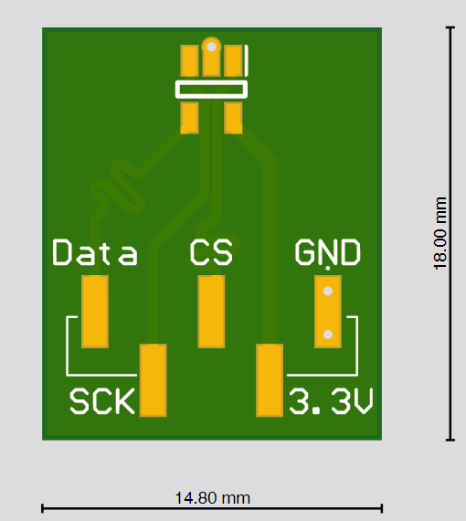
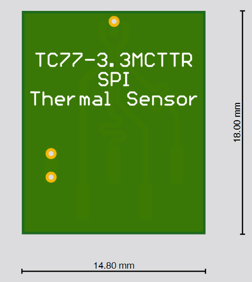

# PCB_for_TC77-3.3MCTTR
Breakout board for the SPI temperature sensor TC77-3.3MCTTR

      

Within the project folder you also find the generated gerber files, in case you dont have altium to genegrate them yourself.
